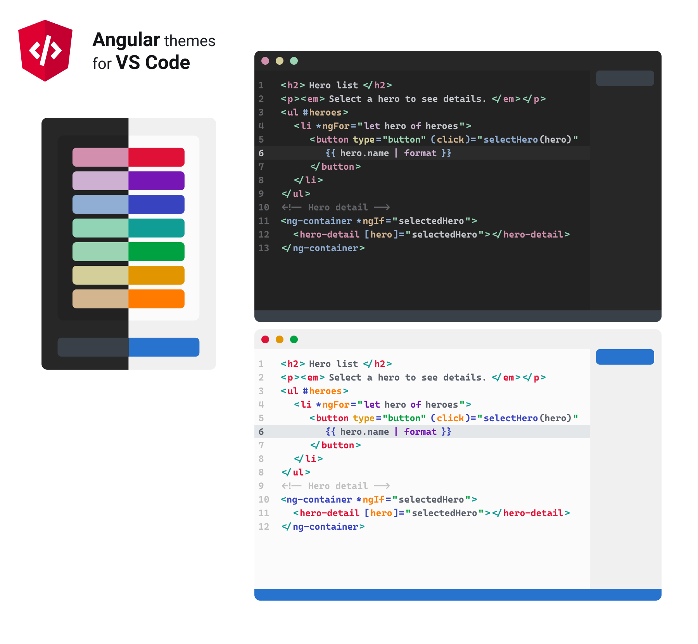

<!--
Created: Sun Oct 31 2021 16:45:19 GMT-0400 (hora de Bolivia)
Modified: Mon Dec 06 2021 22:11:58 GMT-0400 (hora de Bolivia)
-->
<p align="center">
  <a href="https://marketplace.visualstudio.com/items?itemName=MichaellAlavedraMunayco.angular-theme">
    
  </a>
</p>

<h1 align="center">
  Angular's VS Code themes
</h1>

<p align="center">
    <a href="https://github.com/MichaellAlavedraMunayco/angular-vscode-theme/issues">
        
    </a>
    <a href="https://github.com/MichaellAlavedraMunayco/angular-vscode-theme/">
        
    </a>
    <a href="https://github.com/MichaellAlavedraMunayco/angular-vscode-theme/">
        
    </a>
    <a href="https://github.com/MichaellAlavedraMunayco/angular-vscode-theme/">
        
    </a>
</p>



## Install

1. Go to [VS Marketplace](https://marketplace.visualstudio.com/items?itemName=MichaellAlavedraMunayco.angular-theme).
2. Click on the "Install" button.
3. Then [select a theme](https://code.visualstudio.com/docs/getstarted/themes#_selecting-the-color-theme).
    - `Angular Dark` (default)
    - `Angular Light`

## Preferred Settings

> For Angular VS Code Theme to work on HTML templates, please use the [vscode-angular-html](https://marketplace.visualstudio.com/items?itemName=ghaschel.vscode-angular-html) extension

Add this configuration to your VS Code `settings.json` file:

```json
{
    "editor.acceptSuggestionOnCommitCharacter": true,
    "editor.acceptSuggestionOnEnter": "smart",
    "editor.cursorWidth": 3,
    "editor.emptySelectionClipboard": false,
    "editor.fontLigatures": true,
    "editor.fontSize": 12,
    "editor.fontWeight": "400",
    "editor.formatOnPaste": true,
    "editor.formatOnType": true,
    "editor.inlayHints.fontSize": 12,
    "editor.inlineSuggest.enabled": true,
    "editor.lineHeight": 18,
    "editor.minimap.renderCharacters": false,
    "editor.minimap.size": "fit",
    "editor.parameterHints.enabled": true,
    "editor.quickSuggestions": { "other": true, "comments": true, "strings": true },
    "editor.quickSuggestionsDelay": 3,
    "editor.renderControlCharacters": true,
    "editor.renderWhitespace": "all",
    "editor.suggest.localityBonus": true,
    "editor.suggest.preview": true,
    "editor.suggest.showStatusBar": true,
    "editor.suggestFontSize": 12,
    "editor.suggestOnTriggerCharacters": true,
    "editor.suggestSelection": "first",
    "editor.tabCompletion": "on",
    "editor.tabSize": 1,
    "editor.wordBasedSuggestions": true,
    "editor.wordWrap": "on",
    "workbench.sideBar.location": "right",
}
```

## Override this theme

To override this (or any other) theme in your personal config file, please follow the guide in the [color theme](https://code.visualstudio.com/api/extension-guides/color-theme) documentation. This is handy for small tweaks to the theme without having to fork and maintain your own theme.

## Contribute

1. Clone and open this [repository](https://github.com/MichaellAlavedraMunayco/angular-vscode-theme) in VS Code
2. Press `F5` to open a new window with your extension loaded
3. Open `Code > Preferences > Color Theme` [`⌘k ⌘t`] and pick the "Angular ..." theme you want to update.
4. Make changes to the [`/theme`](https://github.com/MichaellAlavedraMunayco/angular-vscode-theme/main/themes) folder.
    - **UI**: For all changes to the "outer UI", like (status bar, file navigation etc.), take a look at the [Theme Color](https://code.visualstudio.com/api/references/theme-color) reference.
    - **Syntax**: For changes to the "code highlighting", examine the syntax scopes by invoking the [`Developer: Inspect Editor Tokens and Scopes`](https://code.visualstudio.com/api/language-extensions/syntax-highlight-guide#scope-inspector) command from the Command Palette (`Ctrl+Shift+P` or `Cmd+Shift+P` on Mac) in the Extension Development Host window.
5. Once you're happy, commit your changes and open a PR.
